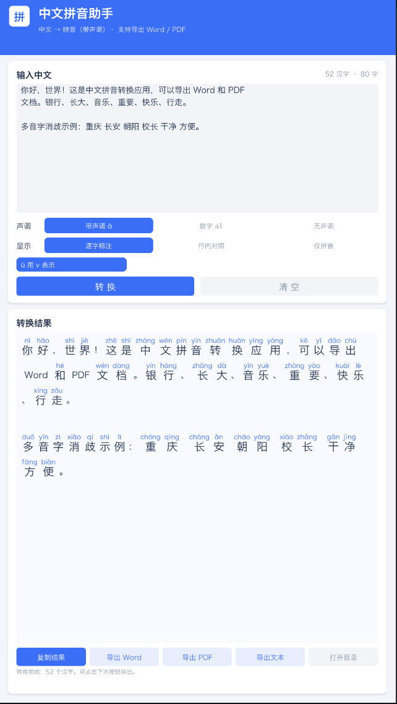

# 中文拼音助手（Unity App）

输入中文，输出「中文 + 带声调拼音」，支持导出 **Word (.docx)**、**PDF**、**纯文本**。
<p align="center">
  
</p>
## 功能

- **中文 → 带声调拼音**：内置 4.4 万单字拼音表 + 5.9 万词级拼音库，多音字按词语智能消歧
  （例：银行 yín háng、长大 zhǎng dà、音乐 yīn yuè、重要 zhòng yào、快乐 kuài lè、方便 fāng biàn、重庆 chóng qìng）。
- **三种声调风格**：带声调符号（nǐ）/ 数字声调（ni3）/ 无声调（ni）。
- **三种显示方式**：逐字标注（拼音在上、汉字在下）/ 行内对照（你(nǐ)）/ 仅拼音。
- **导出 Word / PDF（注音排版）**：标题 + 元信息 + 逐行「拼音行在上、汉字行在下」，
  拼音按词/音节分组、空格分隔、跳过标点（如 `wǒ de lǎo shī` 于 `我的老师` 上方），原生 OOXML / A4 排版。
- **PDF**：自动换行分页，内嵌**子集字体**（只包含用到的字形，文件仅几十 KB），
  文字可复制、可搜索；导出目录默认在 `桌面/中文拼音助手导出/`。
- 支持 ü 用 v 表示（输入法惯例）。
- **UI 分辨率 1080×1920 竖屏**；构建窗口 540×960（0.5 倍显示设计分辨率）。
- **场景确定性包含**：Main Camera（纯色背景）+ EventSystem（可输入）+ Canvas（1080×1920）+ App。

## 项目结构

```
PinyinApp/
├── Assets/
│   ├── Scenes/Main.unity            # 主场景（已创建）
│   ├── Scripts/
│   │   ├── Core/                    # 纯 C# 核心（不依赖 UnityEngine，可独立测试）
│   │   │   ├── ToneUtil.cs          # 声调符号/数字转换
│   │   │   ├── PinyinEngine.cs      # 中文→拼音（多音字消歧）
│   │   │   ├── DocxBuilder.cs       # .docx 生成器（OOXML）
│   │   │   ├── TtfFont.cs           # TTF 解析 + 子集化
│   │   │   └── PdfBuilder.cs        # PDF 生成器（内嵌子集字体）
│   │   └── Unity/                   # Unity 侧
│   │       ├── UiFactory.cs         # UI 工厂（圆角卡片/按钮/输入框）
│   │       ├── AnnotatedOutput.cs   # 逐字注音流式排版
│   │       └── AppController.cs     # App 主控制器 + 启动引导
│   ├── Resources/Data/              # 拼音数据（运行时加载）
│   │   ├── pinyin.txt               # 单字拼音表（U+XXXX: 拼音）
│   │   ├── phrase_pinyin.txt        # 词级拼音（多音字消歧）
│   │   └── zdic_cibs.txt            # 补充词语读音
│   ├── StreamingAssets/NotoSansSC.ttf  # PDF 内嵌用中文字体
│   └── Editor/                      # SceneCreator / BuildScript
├── Tools/Test/                      # 独立测试台（mono 运行，不依赖 Unity）
└── Builds/                          # 构建产物
```

## 运行方式

### 方式一：Unity Editor 内运行（开发）
1. 用 **Unity Hub** 打开本目录（推荐 **2022.3.49f1c1**，2021.3 亦可）。
2. 打开 `Assets/Scenes/Main.unity`，点击 ▶ Play。
3. 输入中文 → 点「转换」→ 导出 Word / PDF。

> 首次打开 Unity 会自动导入资源与脚本，稍等即可。

### 方式二：直接运行构建好的 App
- macOS：双击 `Builds/中文拼音助手.app`（如有构建）。

## 构建命令（命令行）

```bash
UNITY="/Applications/Unity/Hub/Editor/2022.3.49f1c1/Unity.app/Contents/MacOS/Unity"
"$UNITY" -batchmode -quit -projectPath "$(pwd)" \
  -executeMethod BuildScript.BuildMac \
  -logFile unity_build.log
```

## 核心逻辑自测（无需 Unity）

```bash
MONO="/Applications/Unity/Hub/Editor/2022.3.49f1c1/Unity.app/Contents/MonoBleedingEdge/bin/mono"
"$MONO" Tools/Test/TestMain.exe "$(pwd)"
```
会输出拼音转换结果，并生成 `Tools/Test/out/test.docx`、`test.pdf` 用于人工核验。

## 说明与边界

- 未命中词库的多音字取常见读音；人名、文言等特殊读音可能不准，可自行扩充
  `phrase_pinyin.txt`（格式：`词语: 拼音 拼音 …`）。
- PDF 采用子集字体，跨设备（Windows/macOS/手机）均可正常显示中文。
- 导出目录：`桌面/中文拼音助手导出/`；若桌面不可用则回退到程序数据目录。
